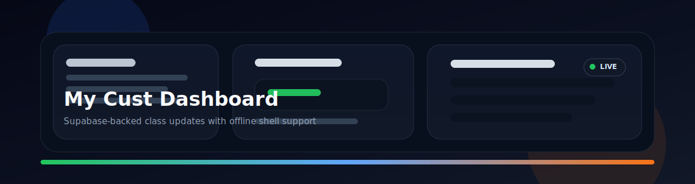
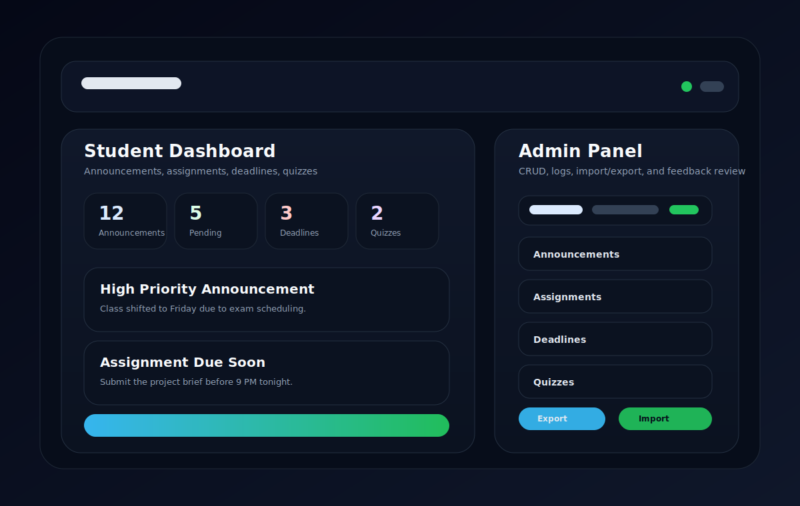

# My Cust Dashboard


<p align="center">
	
</p>

My Cust is a static student and admin dashboard backed by Supabase. It exposes a public class feed for students and a protected admin panel for staff to manage announcements, assignments, deadlines, quizzes, feedback, settings, and audit logs.

## Live Product Summary

The app is intentionally lean: no build step, no framework runtime, and no client-side bundle. It is a plain HTML/CSS/JavaScript PWA with a Supabase data layer, offline shell caching, and a split public/admin experience.

## CI Status

The repository now includes a GitHub Actions workflow at [.github/workflows/ci.yml](.github/workflows/ci.yml) that validates JavaScript syntax and confirms the main static files are present. Once the repo is on GitHub, the badge above will show the live workflow state for every push and pull request.

## Screenshots

<p align="center">
	
</p>

## What It Does

The dashboard currently supports:

- Public viewing of announcements, assignments, deadlines, and quizzes.
- Admin authentication through Supabase Auth.
- Role-aware admin access using an `admin_users` table.
- Create, update, and delete operations for the core content tables.
- Feedback submission from the public dashboard.
- Feedback review and deletion from the admin panel.
- Search and pagination for admin tables.
- Import and export of dashboard data as JSON.
- Audit logging of admin activity.
- Timezone-aware date formatting, currently centered on `Asia/Karachi`.
- PWA install prompts and offline shell caching.

## Architecture

The runtime is split across a small set of files:

- `index.html` renders the student-facing dashboard.
- `admin.html` renders the authenticated admin panel.
- `script.js` provides shared UI behavior such as modals, theme handling, time formatting, connectivity UI, and PWA install handling.
- `dashboard.js` renders the public dashboard, summary stats, detail modals, and feedback flow.
- `admin.js` powers CRUD, pagination, import/export, user management, logs, and admin-side modals.
- `data.js` is the Supabase data layer for auth, reads, writes, caching, permissions, and exports.
- `data-offline.js` provides the offline data path used when the network is unavailable.
- `schema.sql` defines the Supabase tables, indexes, and row-level security policies.
- `sw.js` caches the shell and font assets for offline-first navigation.
- `server.js` is a tiny static file server for local development.

## How It Works

1. The browser loads `index.html` or `admin.html`.
2. Shared helpers from `script.js` initialize the theme, modals, offline banner, and service worker.
3. `data.js` reads Supabase settings and content, then falls back to cached responses when the network is unavailable.
4. `dashboard.js` renders the student view using live or cached data.
5. `admin.js` manages the authenticated workflow for editing content, handling imports/exports, and reviewing logs.
6. `sw.js` keeps the application shell available offline and accelerates repeat visits.

## Setup

### Prerequisites

- Node.js installed locally if you want to use `server.js`.
- A Supabase project.
- Supabase Auth enabled.
- The required database tables created from `schema.sql`.

### Local Setup

1. Create a new Supabase project.
2. Run `schema.sql` in the Supabase SQL editor.
3. Create the admin user in Supabase Auth.
4. Update `config.js` with your Supabase project URL and anon key.
5. Serve the folder with `node server.js` or another static server.

### Run Locally

```bash
node server.js
```

Then open:

- `http://127.0.0.1:4173/index.html`
- `http://127.0.0.1:4173/admin.html`

## Deployment

This project deploys cleanly to any static host because it does not require a Node runtime in production.

### Recommended Targets

- Netlify
- Vercel
- GitHub Pages
- Cloudflare Pages
- Any HTTPS static host

### Production Checklist

1. Serve the app over HTTPS so the service worker and PWA install flow work correctly.
2. Update `config.js` with the production Supabase project URL and anon key.
3. Confirm the required tables exist in Supabase, including the admin support tables.
4. Verify row-level security policies before going live.
5. Test admin login, CRUD, feedback submission, and offline shell caching in the deployed environment.
6. Make sure the service worker can fetch the same asset paths in production.

### Netlify Example

Add a simple publish directory pointing to the repository root. No build command is needed.

### Vercel Example

Deploy the repository as a static site. Keep the root as the output directory and do not add a build step unless you introduce tooling later.

## Repository Map

### Public Dashboard

- `index.html` defines the landing layout, feature cards, feedback modal, and PWA banner.
- `dashboard.js` loads the main data sets, renders the summary counts, and opens item detail modals.
- `data-offline.js` and `data.js` handle cache-backed data loading.

### Admin Panel

- `admin.html` contains the authenticated interface for content management.
- `admin.js` handles tab state, CRUD forms, pagination, import/export, feedback review, admin users, and log views.
- `data.js` performs the actual API calls and permission checks.

### Shared Layer

- `script.js` handles global UI helpers, date formatting, validation, toasts, offline state, and PWA installation.
- `sw.js` caches shell files and font assets.
- `schema.sql` defines the database contract the app expects.

## Data Model

The main schema is centered around these tables:

- `announcements`
- `assignments`
- `deadlines`
- `quizzes`
- `settings`
- `feedback`

The code also expects these supporting tables for admin functionality:

- `admin_users`
- `logs`

Important detail: the current `schema.sql` includes the public content tables, settings, and feedback, but it does not define `admin_users` or `logs`. Those features will fail unless those tables already exist in your Supabase project or you add them to the schema.

## Behavior Notes

- Public reads are intentionally open for the dashboard feed.
- Writes are restricted to authenticated users by row-level security.
- The app caches shell assets and some read responses, but it is not a fully offline database.
- Offline mode is read-only and shell-first; cloud writes still require connectivity.
- The service worker only registers on `https://` or `http://localhost`.
- Dates are formatted in `Asia/Karachi` by default.
- The admin session is stored in session storage and expires after inactivity.

## Production Gaps To Fix

These are the highest-value improvements I found while analyzing the project:

- Add the missing `admin_users` and `logs` tables to `schema.sql` so the documented admin features work out of the box.
- Replace the live Supabase URL and anon key in `config.js` with a generated local config template or documented environment injection step.
- Add a `package.json` even if the app stays framework-free, so local commands, linting, and future scripts are standardized.
- Add a short bootstrap checklist for Supabase row-level security and the required auth roles.
- Move the duplicated session-inactivity logic in `admin.js` and `dashboard.js` into a shared helper.
- Split the large `data.js` file into smaller modules for auth, content, logs, feedback, and export/import.
- Add automated smoke tests for the main public dashboard, admin login, and CRUD flows.
- Add a small verification script that checks the required Supabase tables before the app starts.
- Document the expected `admin_users.role` values and active/inactive semantics directly in the README or schema.
- Consider replacing the current fallback cache approach with a clearer offline-state contract so cached data is easier to reason about.

## Operational Caveats

- Opening the HTML files directly will render the UI, but service worker caching behaves correctly only when served over localhost or HTTPS.
- The current setup is intentionally minimal, so there is no build step, transpilation, or dependency lockfile.
- `config.js` currently contains project-specific Supabase credentials, so treat the repository as environment-specific unless you externalize that file.

## Verification Checklist

After setup, confirm that:

- The student dashboard loads announcements, assignments, deadlines, and quizzes.
- Admin login works with a Supabase Auth user.
- Create, update, delete, import, export, and feedback actions succeed with the expected permissions.
- Offline mode shows the cached shell and an offline banner.
- The service worker registers successfully from localhost.

## Short Summary

This is a static Supabase-backed PWA for class updates. The current codebase is functional, but it benefits from better schema parity, cleaner configuration handling, and a more modular data layer.
